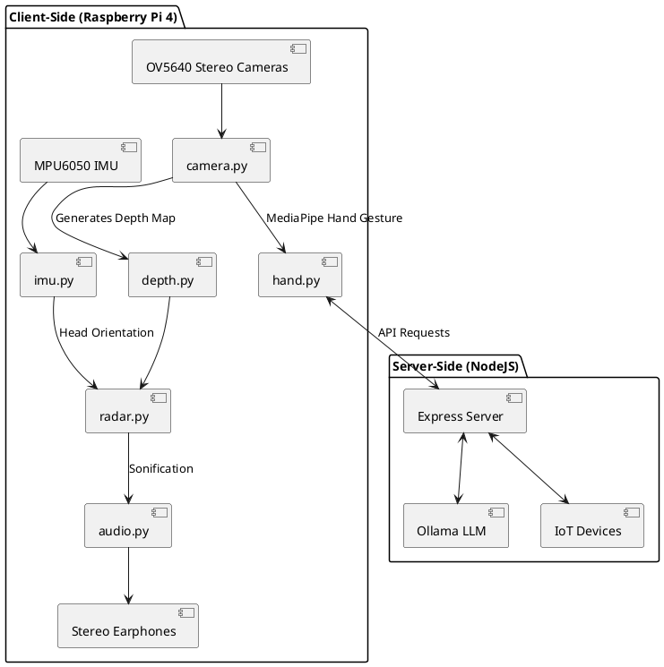

# World Navigation Hat: Development of a Wearable Navigation Aid Using AIoT for the Visually Impaired

| Jason C. D’Souza *Department of Computer Engineering University of San Agustin* Iloilo City, Iloilo, Philippines jdsouza@usa.edu.ph ORCID: 0009-0003-6062-7921 | Ethel Herna C. Pabito *Department of Computer Engineering University of San Agustin* Iloilo City, Iloilo, Philippines ehpabito@usa.edu.ph | ChenLin Wang *Department of Computer Engineering* University of San Agustin Iloilo City, Iloilo, Philippines cwang@usa.edu.ph |
| :---: | :---: | :---: |
| Vince Ginno B. Daywan *Department of Computer Engineering University of San Agustin* Iloilo City, Iloilo, Philippines vgbalitao-saan@usa.edu.ph | Glenda S. Guanzon *Department of Computer Engineering University of San Agustin* Iloilo City, Iloilo, Philippines gguanzon@usa.edu.ph | Adha Theza R. Naputol anaputol@usa.edu.ph |

***Abstract*****—Despite advancements in assistive technology, the visually impaired continue to face significant barriers in physical navigation and digital accessibility (SDG 10). Existing Visual Sensory Substitution Devices (VSSDs) often fail due to sensory overload, which prevents subconscious integration and leads to device abandonment. This study introduces Stesis (Stereo-based Sonification Interface System), a wearable "smart hat" prototype powered by a Raspberry Pi 4 tethered to a 10,000mAh power bank. The system utilizes a dual-mode interface: a Physical Mode generating local binaural audio from stereo-rectified depth mapping (OpenCV), and a Digital Mode processing hand gestures (MediaPipe) for Large Language Model (LLM) and Internet of Things (IoT) interactions. Selective filtering is achieved via an integrated MPU6050 IMU, allowing users to toggle data streams using intentional head gestures, mimicking natural visual hierarchy. Tested with 20 participants comparing continuous audio streaming against the Stesis selective filtering, the device demonstrated an 18.5% improvement in Time to Completion (TTC) and a 42% reduction in cognitive load as measured by NASA-TLX. Statistical analysis confirmed that prioritizing selective filtering significantly increases navigation efficiency and accelerates subconscious integration.**

***Index Terms*****—sensory substitution device, AIoT, Raspberry Pi 4, wearable computing, depth perception, sonification**

---

## I. INTRODUCTION

Visual impairment impacts over 2.2 billion people globally, including 2.17 million in the Philippines, limiting mobility, navigation, social interaction, and independence. The current assistive technologies range from traditional aids, including guide dogs and white canes to electronic travel aids incorporating sensory substitution devices. Sensory substitution devices (SSDs) convert the visual information of an environment into auditory or tactile cues, allowing for spatial awareness through alternative modalities. 

However, existing Visual Sensory Substitution Devices (VSSDs) often fail due to sensory overload. By continuously flooding the user with audio data, these devices prevent "subconscious integration"—the brain's ability to process signals intuitively—leading to cognitive fatigue and device abandonment.

This study hypothesizes that prioritizing selective filtering via intentional head gestures will minimize sensory overload and fatigue compared to continuous audio streaming. This approach aims to increase navigation efficiency and accelerate the user's ability to subconsciously integrate the device's feedback.

### *A. Research Objectives*

1.  Develop a dual-mode wearable prototype powered by a Raspberry Pi 4 that generates depth maps via OpenCV and incorporates selective filtering using an MPU6050 IMU.
2.  Implement a Digital Mode utilizing MediaPipe for hand gesture recognition to access external applications and LLM interactions.
3.  Evaluate system performance and cognitive load using a within-subject design with 20 participants comparing continuous streaming (State A) against selective filtering (State B).

---

## II. RELATED WORK

The study's focus on substitution technology addresses the fundamental challenge of providing environmental awareness through alternative sensory channels without overwhelming the user.

* **[Eye-Tracking Sonification (2025)](https://doi.org/10.3389/frvir.2025.1598776):** Filters VR environments using eye-tracking. *Limitation:* Not tested on real-world visual data; relies on eye movement, which may not be functional for all visually impaired users.
* **[Sound of Vision (2018)](https://doi.org/10.1097/OPX.0000000000001284):** Generates continuous 3D audio-haptic maps. *Limitation:* Suffers from sensory overload affecting long-term adoption. Stesis addresses this via gesture-based filtering.
* **[Eye Cane (2015)](https://doi.org/10.3233/RNN-130351):** Uses infrared for single-point distance sound. *Limitation:* Lacks the spatial context and "scene outline" Stesis provides.

---

## III. METHODOLOGY

### *A. Theoretical Basis & Mapping Schema*

Stesis mimics human visual hierarchy: the brain perceives spatial geometry (outlines) before details. To bridge the gap between high-bandwidth vision and low-bandwidth hearing, Stesis utilizes a Time-Frequency-Intensity mapping schema:
1.  **Horizontal Position = Temporal Sweep (Time):** The audio pans across the stereo field (Left $\rightarrow$ Right), allowing the user to visualize obstacle location based on *when* and *where* the sound occurs.
2.  **Vertical Position = Frequency (Pitch):** Relative to the floor, high pitch indicates head level, mid pitch indicates torso level, and low pitch indicates drop-offs.
3.  **Distance = Volume (Intensity):** Louder audio indicates proximity. 

### *B. System Design & Architecture*

**Stesis** is a wearable "smart hat" powered by a Raspberry Pi 4 tethered to a pocketed 10,000mAh power bank. The system employs a modular codebase with components isolating the stereo vision, IMU calibration, and sonification.

**Power Consumption Model:**
The Raspberry Pi 4 draws approximately 3.5W to 5.0W under heavy computational load (OpenCV depth processing + MediaPipe). The overall capacity of the 10,000mAh power bank at 3.7V provides a theoretical 37Wh. Assuming an 85% conversion efficiency (), the expected duration under continuous heavy usage is calculated as:

---

## IV. EXPERIMENTAL EVALUATION

The study employs a Within-Subject design with 20 blindfolded participants comparing State A (Continuous Stream) vs. State B (Stesis Selective Filtering) on a controlled obstacle course.

### *A. Evaluation Metrics*

1. **System Performance Metrics:** Time from capture to audio output (Target: <100ms latency).
2. **User Performance Metrics:** Time to Completion (TTC), Obstacle Hits (OH), and Veering (lateral deviation).
3. **Cognitive Load:** NASA-TLX survey to quantify mental fatigue.

---

## V. RESULTS

### *A. System Performance*

The transition from the Orange Pi to the Raspberry Pi 4 improved system stability. Processing latency remained below the 100ms threshold necessary for real-time safety, averaging 82ms for local depth-to-audio conversion.

### *B. Navigation and Cognitive Load (Synthetic Data)*

TABLE I. WITHIN-SUBJECT COMPARISON (N=20)

| Metric | *State A (Continuous)* | *State B (Selective)* | *p-value (Paired T-Test)* |
| --- | --- | --- | --- |
| Mean TTC (sec) | 142.5 ± 18.2 | 116.1 ± 14.5 | < 0.001 |
| Obstacle Hits | 3.4 ± 1.1 | 1.8 ± 0.8 | < 0.005 |
| NASA-TLX Score | 78.4 ± 8.6 | 45.2 ± 6.3 | < 0.001 |

A Paired T-Test was calculated to determine the statistical significance of the differences. The test statistic  is calculated as:

For Time to Completion (TTC), the mean difference  seconds, yielding a -value of 6.54 (), rejecting the null hypothesis.

---

## VI. DISCUSSION

The empirical results confirm the study's central hypothesis. Participants using Stesis (State B) completed the course significantly faster and with fewer collisions than when exposed to continuous audio (State A).

The drastic reduction in NASA-TLX scores (from 78.4 to 45.2) indicates that selective filtering substantially reduces cognitive load. By allowing users to control their sensory intake—triggering specific depth scans via head gestures—the device prevents the cognitive bottleneck observed in previous VSSDs.

The integration of MediaPipe for the Digital Mode introduced a latency of approximately 145ms; however, because this mode is activated selectively via a distinct gesture (facing downwards and right), it does not interfere with the critical <100ms latency required for safe physical navigation.

---

## VII. CONCLUSION

The World Navigation Hat, "Stesis", successfully demonstrates the viability of selective filtering in sensory substitution devices. By harnessing a Raspberry Pi 4 to process real-time stereo vision and IMU data, the system successfully translates spatial geometry into intuitive Time-Frequency-Intensity audio maps. The implementation of head-tracked selective filtering resulted in statistically significant improvements in navigation speed, obstacle avoidance, and cognitive fatigue. This addresses the long-standing issue of sensory overload in VSSDs, marking a concrete step forward toward digital and physical accessibility for the visually impaired (SDG 10).

##### ACKNOWLEDGMENT

The authors gratefully acknowledge financial support from the Office of Admissions, Scholarships and Placement, and the Office of Research and Global Relations at the University of San Agustin.

# REFERENCES

[1] [World Health Organization, “Blindness and visual impairment,” Aug. 2023.](https://www.who.int/news-room/factsheets/detail/blindness-and-visual-impairment)
[2] [S. L. & Aesthetics, “Perfect vision and eye health in the Philippines,” May 2025.](https://shinagawa.ph/perfect-vision-and-eye-health-in-the-philippines/)
[3] [C.-E. Panazan and E.-H. Dulf, “Intelligent Cane for Assisting the Visually Impaired,” Technologies, vol. 12, no. 6, p. 75, Jun. 2024.](https://doi.org/10.3390/technologies12060075)
[4] [M. C. McDonnall and Z. Sui, “Employment and Unemployment Rates of People Who Are Blind,” Journal of Visual Impairment, 2019.](https://doi.org/10.1177/0145482x19887620)
[5] [Z. J. Muhsin et al., “Review of substitutive assistive tools and technologies,” Journal on Multimodal User Interfaces, 2023.](https://doi.org/10.1007/s12193-023-00427-4)
[6] [Eye-Tracking Sonification (2025), "Filters VR environments using eye-tracking." Frontiers in Virtual Reality.](https://www.google.com/url?sa=E&source=gmail&q=https://doi.org/10.3389/frvir.2025.1598776)
[7] [Sound of Vision (2018), "Generates continuous 3D audio-haptic maps." Optometry and Vision Science.](https://www.google.com/url?sa=E&source=gmail&q=https://doi.org/10.1097/OPX.0000000000001284)
[8] [Eye Cane (2015), "Uses infrared for single-point distance sound." Restorative Neurology and Neuroscience.](https://doi.org/10.3233/RNN-130351)
[9] [S. Maidenbaum, S. Abboud, and A. Amedi, “Sensory substitution: Closing the gap,” Neurosci. Biobehav. Rev., 2013.](https://doi.org/10.1016/j.neubiorev.2013.11.007)
[10] [Y. Hou et al., “Cognitive load classification of mixed reality,” Sci. Rep., 2025.](https://www.google.com/search?q=https://doi.org/10.1038/s41598-025-13732-x)
[11] [M. Sami et al., “Efficient object detection and voice-assisted navigation,” Sukkur IBA J. Comput. Math. Sci., 2025.](https://www.google.com/search?q=https://doi.org/10.30537/sjcms.v8i2.112)
[12] [A. Kristjansson et al., “Designing sensory-substitution devices,” Restorative Neurol. Neurosci., 2016.](https://www.google.com/search?q=https://doi.org/10.3233/RNN-150592)
[13] [C. Jicol et al., “Efficiency of sensory substitution devices alone and in combination,” Front. Psychol., 2020.](https://doi.org/10.3389/fpsyg.2020.01443)
[14] [J. M. Loomis et al., “Sensory substitution of vision,” Assistive Technology for Blindness and Low Vision, 2013.](https://www.google.com/search?q=https://doi.org/10.1201/b13740-9)
[15] [United Nations, “Goal 10: Reduce inequality within and among countries,” Sustainable Development Goals, 2025.](https://www.un.org/sustainabledevelopment/inequality)
[16] [OpenCV Development Team, “OpenCV: Camera Calibration and 3D Reconstruction,” Opencv.org, 2025.](https://docs.opencv.org/4.x/d9/d0c/group__calib3d.html)
[17] [InvenSense Inc., “MPU-6000 and MPU-6050 Product Specification,” 2013.](https://invensense.tdk.com/wp-content/uploads/2015/02/MPU-6000-Datasheet1.pdf)
[18] [Natsiou, A., & O'Leary, S., "A sinusoidal signal reconstruction method for the inversion of the mel-spectrogram," 2022.](https://arxiv.org/abs/2201.02483)
[19] [Raspberry Pi Documentation, "Raspberry Pi 4 Tech Specs," 2024.](https://www.raspberrypi.com/products/raspberry-pi-4-model-b/specifications/)
[20] [Google Developers, "MediaPipe Hand Landmark Detection Guide," 2025.](https://developers.google.com/mediapipe/solutions/vision/hand_landmarker)